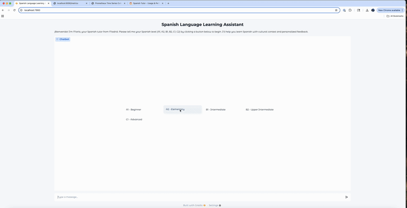

# 🇪🇸 Spanish Tutor

An AI-powered chatbot with robust error handling, and full-stack observability.
This project shows how to containerize an application with Docker, add metrics and observability, and use Helm with Kubernetes.


---

## Table of Contents
- [Architecture Overview](#architecture-overview)
- [Features](#features)
- [Demo](#demo)
- [Quick Start](#quick-start)
- [API Endpoints](#api-endpoints)
- [Observability](#observability)
- [Error Handling & Reliability](#error-handling--reliability)
- [Testing](#testing)
- [Configuration](#configuration)
- [Contributing](#contributing)
- [Acknowledgments](#acknowledgments)
- [Why This Project?](#why-this-project)

---

## Architecture Overview

- **Gradio UI**: Modern, chat-style web interface for learners.
- **FastAPI Backend**: Processes chat messages, handles errors, and exposes Prometheus metrics.
- **Ollama/OpenAI-Compatible LLM**: Local or remote LLM inference for cost-effective, private tutoring.
- **Prometheus & Grafana**: Real-time metrics, dashboards, and alerting.
- **Kubernetes (Kind)**: Local Kubernetes cluster for development and testing.

---

## Features

- Adaptive conversation practice (A1–C2 levels)
- Real-time English translation
- Robust error handling with custom exceptions and HTTP status codes
- Automatic retry logic for transient LLM/model failures
- Prometheus metrics for chat usage, latency, error types, and HTTP status codes
- Pre-built Grafana dashboards for usage, performance, and reliability
- Comprehensive test suite for core logic, API, and UI

---

## Demo




---

##  Quick Start (Recommended)

### 1. Set up your environment variables
Create a `.env` file in the project root:
```bash
echo "LLM_API_KEY=your-api-key" > .env
echo "LLM_BASE_URL=your-llm-base-url" >> .env
echo "API_URL=http://spanish-tutor-api:8000/chat" >> .env
```

### 2. Build and load the Docker image
```bash
make docker-build
```

### 3. Start your local Kubernetes cluster (Kind)
```bash
make kind-setup
```

### 4. Load the Docker image into Kind
```bash
kind load docker-image spanish-tutor:latest
```

### 5. Generate Helm values file from your .env
```bash
make envsubst-values
```

### 6. Install (or upgrade) the Helm chart
```bash
make helm-install
# If already installed, use:
# make helm-upgrade
```

### 7. Restart all services (if needed)
```bash
make restart-services
```

### 8. Port forward to access all services
```bash
make port-forward
```

### 9. Access the app and monitoring
- UI:  http://localhost:7860
- API: http://localhost:8000
- Prometheus: http://localhost:9090
- Grafana: http://localhost:3000 (admin/admin)

**Note:** If Grafana shows no metrics, ensure the data source is properly configured to connect to `spanish-tutor-prometheus:9090`.

**Note:** All resources are deployed in the `spanish-tutor` namespace. All Makefile commands use this namespace by default.

---

## How to Restart Services

To restart all deployments (API, UI, Prometheus, Grafana) in the namespace:
```bash
make restart-services
```

## How to Clean Up and Re-Deploy Everything

1. Uninstall the Helm release:
   ```bash
   make helm-uninstall
   ```
2. (Optional) Delete the namespace:
   ```bash
   kubectl delete namespace spanish-tutor || true
   ```
3. (Optional) Delete the Kind cluster:
   ```bash
   kind delete cluster
   ```
4. Re-run the Quick Start steps above.

## How to Get Everything Running

1. Ensure your `.env` is correct and loaded.
2. Build and load the Docker image: `make docker-build`
3. Start Kind: `make kind-setup`
4. Load the image into Kind: `kind load docker-image spanish-tutor:latest`
5. Generate values: `make envsubst-values`
6. Install/upgrade Helm: `make helm-install` or `make helm-upgrade`
7. Restart services if needed: `make restart-services`
8. Port forward: `make port-forward`
9. Open the UI, API, Prometheus, and Grafana in your browser.

## One-Liner Commands

**Restart and port-forward everything:**
```bash
pkill -f 'kubectl port-forward' && make restart-services && make port-forward
```

---

##  Prerequisites

### For Local Development
- Docker
- Python 3.10+
- LLM API credentials (OpenAI, Anthropic, etc. or if using locally)

### For Kubernetes Deployment
- kubectl
- Helm
- Kind (for local testing)

## Development

### Install Dependencies
```bash
make install
```

### Run Tests
```bash
make test
```

### Run Linters
```bash
make lint
```

### Build Docker Image
```bash
make docker-build
```

## Monitoring & Observability

### Prometheus Metrics
- HTTP request metrics with status codes
- Chat request rates and latency
- Error tracking by type
- Custom application metrics

### Grafana Dashboards
- Real-time request rates and latency
- Error rates and types
- Resource utilization
- Custom application dashboards

## API Endpoints

### Health Check
```bash
GET /health
```

### Chat Endpoint
```bash
POST /chat
{
  "message": "Hola como esta?",
  "history": [["user", "Hola"], ["assistant", "Como te llama?"]]
}
```

### Metrics
```bash
GET /metrics
```

##  Testing

### Run All Tests
```bash
make test
```

### Run Specific Tests
```bash
pytest tests/test_api.py -v
pytest tests/test_endpoints.py -v
```

### Test Coverage
```bash
pytest tests/ --cov=spanishtutor --cov-report=html
```

##  Security

- API keys stored in Kubernetes secrets
- Environment variable configuration
- Health checks and readiness probes
- Resource limits and requests

##  Scaling

### Horizontal Scaling
- Kubernetes Horizontal Pod Autoscaling (HPA)
- Multiple API replicas
- Load balancer distribution

### Vertical Scaling
- Configurable resource limits
- CPU and memory optimization
- Performance monitoring

## 🛠️ Troubleshooting

### Common Issues

1. **Service not accessible**
   ```bash
   make status
   make port-forward
   ```

2. **Pod not starting**
   ```bash
   make logs
   make logs-ui
   kubectl describe pod -l app=spanish-tutor-api -n spanish-tutor
   ```

3. **Image not found**
   ```bash
   kind load docker-image spanish-tutor:latest
   ```

4. **Grafana shows no metrics**
   ```bash
   # Check if Prometheus data source is configured correctly
   kubectl get configmap grafana-ds -n spanish-tutor -o yaml
   # Should show: url: http://spanish-tutor-prometheus:9090
   ```

5. **Grafana not accessible**
   ```bash
   # Ensure port forwarding is running
   ps aux | grep "port-forward.*grafana"
   # Restart if needed
   kubectl port-forward svc/spanish-tutor-grafana 3000:3000 -n spanish-tutor
   ```

### Useful Commands
```bash
# Check deployment status
make status

# View logs
make logs
make logs-ui

# Scale deployments
kubectl scale deployment spanish-tutor-api --replicas=3 -n spanish-tutor

# Check service endpoints
kubectl get endpoints -n spanish-tutor

# Verify Grafana data source
kubectl get configmap grafana-ds -n spanish-tutor -o yaml
```

## 📚 Documentation

- [Kubernetes Deployment Guide](README-KUBERNETES.md) - Detailed K8s setup
- [Deployment Options](DEPLOYMENT.md) - Complete deployment comparison
- [Helm Chart Documentation](helm/spanish-tutor/README.md) - Chart configuration

---

## Why This Project?

SpanishTutor explores adding observability, error handling, Docker, and Kubernetes for a project using LLMs.

---

